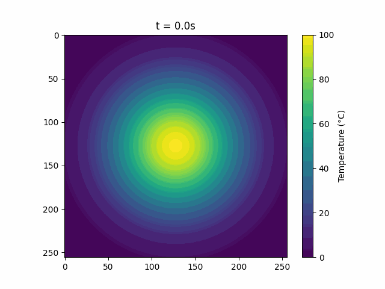

# Evaluating High-Level Abstraction Frameworks for the Heat Equation

**Author:** Mehmed Mulalic  
**Institution:** University of Vienna  
**Supervisor:** ao. Univ.-Prof. Dipl.-Ing. Dr. Eduard Mehofer  
**Date:** February 2026

---

## Overview

This repository contains the implementations and results accompanying the report *Evaluating High-Level Abstraction Frameworks for the Heat Equation*. The study evaluates the performance of high-level Python GPU frameworks — **CuPy** and **Numba** — against a sequential NumPy/SciPy baseline for solving the 2D Heat Equation using three distinct numerical methods: Five-Point Stencil, Sparse Laplacian Matrix, and Spectral DCT.

---

## Simulation Animation

Below is the time evolution of the 2D heat equation using the sequential stencil method. The animation shows the diffusion of an initial Gaussian temperature distribution under Neumann zero-flux boundary conditions.



---

## Requirements

All experiments were conducted on an **NVIDIA Tesla A100** (Ampere, 80 GB VRAM) with CUDA 12.8.

### Python Dependencies

```
Python   3.12
NumPy    2.3
SciPy    1.16
CuPy     13.6
Numba    0.62
```

Install dependencies:

Run the `./install.nvidia.sh` script to install all requirements with Conda.

---

## Running the Implementations

All scripts accept optional grid size arguments. If omitted, they default to a 256×256 grid. Output CSV files are saved to the `results/` directory.

```bash
python <file.py> <nx> <ny>
```

---

## Simulation Parameters

| Parameter | Value |
|---|---|
| Domain | [0,1] × [0,1] m² |
| Grid sizes tested | 256, 512, 1024, 1536, 2048 |
| Time step (Δt) | 5 × 10⁻³ s |
| Total simulation time | 60 s |
| Number of time steps | 12,000 |
| Thermal diffusivity (α) | 1.6563 × 10⁻⁴ m²/s (99.9% pure silver) |
| Initial condition | Gaussian bump, A = 100°C, σ = 0.05 m, centred at (0.5, 0.5) |
| Boundary condition | Neumann zero-flux (∂u/∂n = 0) |

---

## Profiling

GPU profiling was performed using NVIDIA Nsight Systems at grid size 256×256. Profile files (`.nsys-rep` and `.sqlite`) are provided in the `profiling/` directory. To regenerate profiles:

```bash
nsys profile python ./cupy_stencil_explicit.py
```

---

## Report

The full report is included in this repository as `Praktikum_P2.pdf`.
